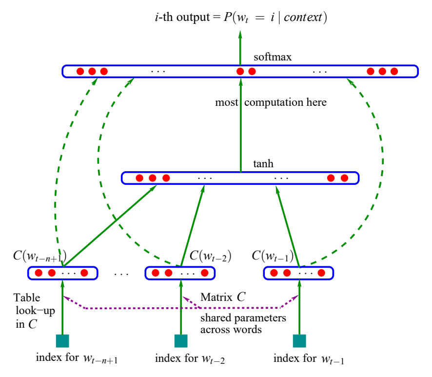

# 神经概率语言模型（A Neural Probabilistic Language Model）

**作者：** Yoshua Bengio、Réjean Ducharme、Pascal Vincent、Christian Jauvin  
**刊物：** *Journal of Machine Learning Research*，第 3 卷（2003），第 1137–1155 页  
**投稿：** 2002 年 4 月；**发表：** 2003 年 2 月

| 作者 | 电子邮箱 |
|---|---|
| Yoshua Bengio | bengioy@iro.umontreal.ca |
| Réjean Ducharme | ducharme@iro.umontreal.ca |
| Pascal Vincent | vincentp@iro.umontreal.ca |
| Christian Jauvin | jauvinc@iro.umontreal.ca |

**作者单位：** 加拿大魁北克省蒙特利尔市，蒙特利尔大学（Université de Montréal），计算机科学与运筹学系（Département d’Informatique et Recherche Opérationnelle）、数学研究中心（Centre de Recherche Mathématiques）。

**编辑：** Jaz Kandola、Thomas Hofmann、Tomaso Poggio、John Shawe-Taylor。

© 2003 Yoshua Bengio、Réjean Ducharme、Pascal Vincent、Christian Jauvin。

> 译文说明：本译文依据同目录的 `bengio03a.pdf`，保留原文的章节、公式编号、实验数据、脚注和参考文献。重要术语采用“中文（English）”；图 1 保留原图，并提供中文图注及标注对照。原文中少数符号或表述不一致之处以“译注”明确说明。文中“目前”“最先进”等表述均指论文发表时的情况。

## 目录

- [摘要](#abstract)
- [1. 引言](#sec-1)
- [2. 神经网络模型](#sec-2)
- [3. 并行实现](#sec-3)
- [4. 实验结果](#sec-4)
- [5. 扩展与未来工作](#sec-5)
- [6. 结论](#sec-6)
- [致谢](#acknowledgments)
- [原文脚注](#footnotes)
- [参考文献](#references)

## 摘要（Abstract）

统计语言建模（statistical language modeling）的一个目标，是学习一种语言中词序列的联合概率函数（joint probability function）。由于维数灾难（curse of dimensionality），这一任务本身十分困难：用于测试模型的词序列，很可能不同于训练期间见过的所有词序列。基于 $n$ 元语法（$n$-gram）的传统方法虽然非常成功，却是通过拼接训练集中出现过的、彼此重叠的极短序列来实现泛化（generalization）。我们提出，通过学习词的分布式表示（distributed representation）来应对维数灾难，使每个训练句子都能为模型提供关于指数级数量的、语义相近句子的信息。模型同时学习两部分内容：（1）每个词的分布式表示；（2）用这些表示来表达的词序列概率函数。如果一个从未出现过的词序列由一些词组成，而这些词与某个已出现句子中的词相似，也就是它们的表示在空间中彼此邻近，那么这个新序列就会获得较高的概率，泛化由此实现。在合理时间内训练这种具有数百万参数的大型模型，本身也是一项重大挑战。我们报告了使用神经网络（neural network）来表示概率函数的实验。在两个文本语料库（text corpora）上的结果表明，所提出的方法显著优于当时最先进的 $n$ 元语法模型，并且能够利用更长的上下文（context）。

**关键词：** 统计语言建模（statistical language modeling）；人工神经网络（artificial neural networks）；分布式表示（distributed representation）；维数灾难（curse of dimensionality）。

## 1. 引言（Introduction）

使语言建模以及其他学习问题变得困难的一个根本问题，是维数灾难。当我们希望对许多离散随机变量（discrete random variables）的联合分布（joint distribution）建模时，这一问题尤为明显，例如句子中的词，或数据挖掘任务中的离散属性。假设一种自然语言的词表（vocabulary）$V$ 包含 100,000 个词，若要对其中连续 10 个词的联合分布建模，潜在的自由参数（free parameters）数量就达到 $100{,}000^{10}-1=10^{50}-1$。对连续变量（continuous variables）建模时，我们更容易实现泛化，例如使用多层神经网络（multi-layer neural networks）或高斯混合模型（Gaussian mixture models）等平滑函数族，因为可以预期，待学习的函数具有某些局部平滑性（local smoothness）。对于离散空间，泛化所依赖的结构却没有那么明显：这些离散变量的任何变化，都可能使待估计的函数值发生剧烈变化；当每个离散变量的可取值数量很大时，大多数观测对象之间的汉明距离（Hamming distance）几乎都接近其最大值。

受非参数密度估计（non-parametric density estimation）观点的启发，我们可以用一种直观方式理解不同学习算法如何泛化：最初集中在训练点，例如训练句子上的概率质量（probability mass），如何扩散到更大的空间区域中，通常是扩散到训练点周围某种形式的邻域（neighborhood）。在高维空间中，关键在于将概率质量分配到真正相关的区域，而不是沿着每个训练点周围的所有方向均匀分散。本文将说明，我们提出的方法与以往最先进的统计语言建模方法，其泛化方式存在根本差异。

语言的统计模型可以表示为：给定之前所有词时，下一个词的条件概率（conditional probability）。这是因为

$$
\hat{P}(w_1^T)=\prod_{t=1}^{T}\hat{P}(w_t\mid w_1^{t-1}),
$$

其中，$w_t$ 是第 $t$ 个词，子序列记作 $w_i^j=(w_i,w_{i+1},\ldots,w_{j-1},w_j)$。这种统计语言模型已经在许多涉及自然语言的技术应用中发挥作用，例如语音识别（speech recognition）、语言翻译（language translation）和信息检索（information retrieval）。因此，统计语言模型的改进可能对这些应用产生重要影响。

为自然语言构建统计模型时，可以利用词序，以及词序列中时间位置越接近的词在统计上依赖性越强这一事实，大幅降低建模难度。因此，$n$ 元语法模型针对大量不同的上下文，也就是最近 $n-1$ 个词的不同组合，构建下一个词的条件概率表：

$$
\hat{P}(w_t\mid w_1^{t-1})\approx\hat{P}(w_t\mid w_{t-n+1}^{t-1}).
$$

我们只考虑训练语料库（training corpus）中实际出现过，或者出现得足够频繁的连续词组合。如果出现了训练语料中从未见过的新 $n$ 词组合，会怎样？我们不希望给这些情况分配零概率，因为这种新组合很可能出现，而且上下文越长，它们出现得就越频繁。一种简单的处理方式，是参考使用更短上下文得到的概率预测；回退三元语法模型（back-off trigram model）（Katz, 1987）以及平滑三元语法模型（smoothed trigram model），也称插值三元语法模型（interpolated trigram model）（Jelinek and Mercer, 1980），采用的正是这种思路。那么，这类模型究竟如何从训练语料中见过的词序列泛化到新的词序列？可以通过与这些插值或回退 $n$ 元语法模型相对应的生成模型（generative model）来理解这一过程。本质上，生成新词序列，就是把训练数据中频繁出现过的、长度为 1、2，直到 $n$ 个词的极短且相互重叠的片段“粘接”起来。下一个片段的概率如何获得，隐含在具体的回退或插值 $n$ 元语法算法中。研究者通常使用 $n=3$，即三元语法（trigram），并取得了当时最先进的结果；但也可参见 Goodman（2001），其中展示了结合多种技巧如何带来显著改进。显然，紧接在待预测词之前的序列所包含的信息，远不止前面一两个词的身份。这类方法至少有两个亟待改进的方面，也是本文关注的重点。第一，它没有考虑距离超过一两个词的上下文；[^1] 第二，它没有考虑词之间的“相似性”。例如，在训练语料中见过句子“那只猫正在卧室里走动”（The cat is walking in the bedroom），应该有助于我们泛化，使句子“一条狗当时正在一个房间里奔跑”（A dog was running in a room）也获得近似的概率。原因很简单：狗（dog）与猫（cat），以及定冠词（the）与不定冠词（a）、房间（room）与卧室（bedroom）等，具有相似的语义作用和语法作用。

针对这两个问题，已有许多方法被提出。第 1.2 节将简要说明本文方法与其中一些既有方法之间的联系。我们首先讨论所提方法的基本思想，然后在第 2 节中给出更形式化的描述，采用共享参数的多层神经网络（shared-parameter multi-layer neural networks）来实现这些思想。本文的另一项贡献涉及一项挑战：如何用非常大的数据集，即数百万或数千万个样本，训练具有数百万参数的超大型神经网络。最后，本文的一项重要贡献是表明：训练这种大规模模型虽然代价高昂，但确实可行；模型可以扩展到较长的上下文，并能在比较实验中取得良好结果，详见第 4 节。

本文的许多运算采用矩阵记号：小写 $v$ 表示列向量（column vector），$v'$ 表示它的转置（transpose）；$A_j$ 表示矩阵 $A$ 的第 $j$ 行；$x\mathbin{.}y=x'y$ 表示内积（inner product）。

### 1.1 用分布式表示应对维数灾难（Fighting the Curse of Dimensionality with Distributed Representations）

所提方法的核心思想可以概括为以下三点：

1. 为词表中的每个词关联一个**分布式词特征向量（distributed word feature vector）**，即 $\mathbb{R}^m$ 中的实值向量。
2. 用词序列中各个词的特征向量，来表达该词序列的联合概率函数。
3. **同时学习**词特征向量以及该概率函数的参数。

特征向量表示一个词的不同方面：每个词都对应向量空间（vector space）中的一个点。特征数量，例如本实验中的 $m=30$、60 或 100，远小于词表大小，例如 17,000。概率函数被表示为一系列条件概率的乘积，即给定前面的词时下一个词的概率；例如，在实验中使用多层神经网络，根据前面的词预测下一个词。这个函数的参数可以通过迭代调整，以最大化训练数据的对数似然（log-likelihood）或某个正则化准则（regularized criterion），例如加入权重衰减惩罚（weight decay penalty）。[^2] 与各个词关联的特征向量是通过学习获得的，但也可以利用语义特征方面的先验知识（prior knowledge）对其进行初始化。

为什么这种方法有效？在前面的例子中，如果我们知道狗（dog）与猫（cat）在语义和句法上发挥相似作用，并且以下词对也有类似关系：定冠词与不定冠词（the, a）、卧室与房间（bedroom, room）、be 动词的现在时与过去时形式（is, was）、奔跑与走动（running, walking），那么就可以自然地进行泛化，也就是转移概率质量。例如，从

> 那只猫正在卧室里走动。  
> `The cat is walking in the bedroom`

泛化到

> 一条狗当时正在一个房间里奔跑。  
> `A dog was running in a room`

同样也可以泛化到

> 那只猫正在一个房间里奔跑。  
> `The cat is running in a room`
>
> 一条狗正在一间卧室里走动。  
> `A dog is walking in a bedroom`
>
> 那条狗当时正在那个房间里走动。  
> `The dog was walking in the room`
>
> ……

以及许多其他组合。在所提出的模型中，之所以会出现这种泛化，是因为我们期望“相似”的词具有相似的特征向量，而概率函数又是这些特征值的平滑函数（smooth function），所以特征的小幅变化只会引起概率的小幅变化。因此，训练数据中只要出现上述句子中的一个，就不仅会提高这个句子自身的概率，还会提高句子空间中与它相邻的、数量呈组合式增长的许多“邻居”的概率。这里的句子空间由特征向量序列来表示。

### 1.2 与既有工作的关系（Relation to Previous Work）

用神经网络对高维离散分布（high-dimensional discrete distribution）建模，已经被证明有助于学习一组随机变量 $Z_1\cdots Z_n$ 的联合概率，其中各个变量的性质可能不同（Bengio and Bengio, 2000a,b）。在该模型中，联合概率被分解为条件概率的乘积：

$$
\hat{P}(Z_1=z_1,\ldots,Z_n=z_n)
=\prod_i\hat{P}\!\left(Z_i=z_i\mid g_i(Z_{i-1}=z_{i-1},Z_{i-2}=z_{i-2},\ldots,Z_1=z_1)\right),
$$

其中，$g(\cdot)$ 是由具有特殊从左到右结构（left-to-right architecture）的神经网络表示的函数。按照某个任意指定的变量顺序，第 $i$ 个输出块 $g_i(\cdot)$ 计算相应参数，用来表达给定前面各个 $Z$ 的取值时 $Z_i$ 的条件分布。在四个 UCI 数据集上的实验表明，与其他方法相比，该方法表现很好（Bengio and Bengio, 2000a,b）。本文必须处理句子这类长度可变的数据，因此需要调整上述方法。另一个重要区别是：这里所有的 $Z_i$，即第 $i$ 个位置上的词，都指向同一类型的对象，也就是词。因此，本文模型引入了跨时间的参数共享（parameter sharing），即在不同时间使用同一个 $g_i$，同时还在不同位置的输入词之间共享参数。这是对同一思想的一次成功的大规模应用，同时结合了为符号数据（symbolic data）学习分布式表示这一较早的思想；后者在联结主义（connectionism）的早期就已被倡导（Hinton, 1986；Elman, 1990）。此后，Hinton 的方法得到改进，并在多种符号关系的学习上获得了成功验证（Paccanaro and Hinton, 2000）。使用神经网络进行语言建模也并非新思想，例如 Miikkulainen and Dyer（1991）的工作。本文则将这一思想推进到大规模应用，着重学习词序列分布的统计模型，而不是学习词在句子中的角色。本文方法也与此前的字符级文本压缩（character-based text compression）方案有关：这类方案使用神经网络预测下一个字符的概率（Schmidhuber, 1996）。Xu and Rudnicky（2000）也独立提出了使用神经网络进行语言建模的思想，不过他们的实验采用没有隐藏单元（hidden units）、且只输入一个词的网络，这使模型基本上只能捕捉一元语法（unigram）和二元语法（bigram）的统计信息。

通过发现词之间的某些相似性，从训练序列泛化到新序列，这一思想并不新颖。例如，基于学习词聚类（word clustering）的方法就利用了它（Brown et al., 1992；Pereira et al., 1993；Niesler et al., 1998；Baker and McCallum, 1998）：每个词以确定方式或概率方式与一个离散类别（discrete class）关联，同一类别中的词在某些方面相似。在本文模型中，我们不再通过离散的随机变量或确定性变量来描述相似性，这类变量对应于对词集合进行软划分或硬划分（soft or hard partition）；而是为每个词使用一个连续实向量，也就是**学习得到的分布式特征向量（learned distributed feature vector）**，来表示词之间的相似性。本文的实验比较包括基于类别的 $n$ 元语法（class-based $n$-gram）的结果（Brown et al., 1992；Ney and Kneser, 1993；Niesler et al., 1998）。

词的向量空间表示（vector-space representation）已经在信息检索领域得到广泛应用，例如 Schutze（1993）的工作。在这一领域，词的特征向量根据它们在同一文档中共同出现的概率来学习；相关方法是潜在语义索引（Latent Semantic Indexing，LSI），参见 Deerwester et al.（1990）。一个重要区别是，本文要寻找的词表示，应当有助于紧凑地表达自然语言文本中词序列的概率分布。实验表明，**联合学习表示，也就是词特征，以及模型本身**，非常有用。我们曾尝试把词 $w$ 与其周围文本中其他词的共现频率（co-occurrence frequencies）的前几个主成分（principal components），作为每个词 $w$ 的固定特征，但未能成功。这与信息检索中对文档使用 LSI 的做法相似。不过，Bellegarda（1997）已经在基于 $n$ 元语法的统计语言模型中成功利用了词的连续表示（continuous representation），通过 LSI 动态识别当前话语的主题。

在神经网络中，符号的向量空间表示这一思想，此前还被表述为参数共享层（parameter sharing layer），例如用于二级结构预测（secondary structure prediction）的 Riis and Krogh（1996），以及用于文本到语音映射（text-to-speech mapping）的 Jensen and Riis（2000）。

## 2. 神经网络模型（A Neural Model）

训练集是一个词序列 $w_1\cdots w_T$，其中每个词 $w_t\in V$，词表（vocabulary）$V$ 是一个规模较大但有限的集合。我们的目标是学习一个良好的模型 $f(w_t,\ldots,w_{t-n+1})=\hat{P}(w_t\mid w_1^{t-1})$；这里的“良好”是指模型能够在样本外数据上取得较高的似然（out-of-sample likelihood）。下文报告的是 $1/\hat{P}(w_t\mid w_1^{t-1})$ 的几何平均值（geometric average），也称为困惑度（perplexity）；它也等于平均负对数似然（average negative log-likelihood）的指数。对模型的唯一约束是：对于任意给定的 $w_1^{t-1}$，都有

$$
\sum_{i=1}^{|V|}f(i,w_{t-1},\ldots,w_{t-n+1})=1,\qquad f>0.
$$

将这些条件概率（conditional probabilities）相乘，就能得到词序列的联合概率（joint probability）模型。

我们将函数 $f(w_t,\ldots,w_{t-n+1})=\hat{P}(w_t\mid w_1^{t-1})$ 分解为两个部分：

1. 一个映射 $C$，将 $V$ 中的任意元素 $i$ 映射为实向量 $C(i)\in\mathbb{R}^m$。它表示与词表中每个词对应的分布式特征向量（distributed feature vector）。在实际实现中，$C$ 由一个大小为 $|V|\times m$ 的自由参数（free parameters）矩阵表示。

2. 一个借助 $C$ 表达的词概率函数：函数 $g$ 将上下文（context）中各词的特征向量序列 $(C(w_{t-n+1}),\ldots,C(w_{t-1}))$ 作为输入，并将其映射为下一个词 $w_t$ 在词表 $V$ 上的条件概率分布（conditional probability distribution）。$g$ 的输出是一个向量，其第 $i$ 个元素估计概率 $\hat{P}(w_t=i\mid w_1^{t-1})$，如图 1 所示。

$$
f(i,w_{t-1},\ldots,w_{t-n+1})
=g(i,C(w_{t-1}),\ldots,C(w_{t-n+1})).
$$

函数 $f$ 是这两个映射（$C$ 和 $g$）的复合，其中 $C$ 由上下文中所有词共享。这两个部分各自对应一组参数。映射 $C$ 的参数就是特征向量本身，它们由一个大小为 $|V|\times m$ 的矩阵 $C$ 表示，其中第 $i$ 行是词 $i$ 的特征向量 $C(i)$。函数 $g$ 可以由前馈神经网络（feed-forward neural network）、循环神经网络（recurrent neural network），或其他具有参数 $\omega$ 的参数化函数来实现。完整参数集为 $\theta=(C,\omega)$。

**图 1：** 神经网络结构（neural architecture）：$f(i,w_{t-1},\ldots,w_{t-n+1})=g(i,C(w_{t-1}),\ldots,C(w_{t-n+1}))$，其中 $g$ 为神经网络，$C(i)$ 为第 $i$ 个词的特征向量。

图中标注对照：

| 原图标注 | 中文含义 |
|---|---|
| $i$-th output $=P(w_t=i\mid context)$ | 第 $i$ 个输出：给定上下文时，下一个词为 $i$ 的概率 |
| softmax | Softmax 归一化输出层（softmax） |
| most computation here | 大部分计算发生在此处 |
| tanh | 双曲正切（hyperbolic tangent）激活函数 |
| $C(w_{t-n+1})$、$C(w_{t-2})$、$C(w_{t-1})$ | 对应上下文各词的特征向量 |
| Table look-up in $C$ | 在 $C$ 中查表（table look-up） |
| Matrix $C$ | 矩阵 $C$ |
| shared parameters across words | 各词之间共享参数 |
| index for $w_{t-n+1}$ | 词 $w_{t-n+1}$ 的索引（index） |
| index for $w_{t-2}$ | 词 $w_{t-2}$ 的索引 |
| index for $w_{t-1}$ | 词 $w_{t-1}$ 的索引 |

训练通过寻找使训练语料的带惩罚项对数似然（penalized log-likelihood）最大化的 $\theta$ 来完成：

$$
L=\frac{1}{T}\sum_t\log f(w_t,w_{t-1},\ldots,w_{t-n+1};\theta)+R(\theta),
$$

其中 $R(\theta)$ 为正则化项（regularization term）。例如，在我们的实验中，$R$ 是权重衰减（weight decay）惩罚项，仅作用于神经网络的权重以及矩阵 $C$，而不作用于偏置（biases）。[^3]

在上述模型中，自由参数的数量仅随词表中的词数 $|V|$ **线性增长**。它也仅随阶数（order）$n$ **线性增长**；如果引入更多共享结构，例如采用时延神经网络（time-delay neural network）、循环神经网络，或二者的组合，则可以将这种增长进一步降为次线性（sub-linear）。

在下文的大多数实验中，神经网络在词特征映射之外还包含一个隐藏层（hidden layer），并且可以选择加入从词特征直接连接到输出的连接。因此，实际上有两个隐藏层：一层是共享的词特征层 $C$，其中没有非线性变换（加入非线性变换也不会带来任何有用的信息）；另一层是普通的双曲正切隐藏层。更确切地说，神经网络计算下面的函数，并使用 Softmax 输出层来保证所有概率均为正且总和为 1：

$$
\hat{P}(w_t\mid w_{t-1},\ldots,w_{t-n+1})
=\frac{e^{y_{w_t}}}{\sum_i e^{y_i}}.
$$

其中，$y_i$ 是每个输出词 $i$ 的未归一化对数概率（unnormalized log-probabilities），通过参数 $b,W,U,d,H$ 按如下方式计算：

$$
y=b+Wx+U\tanh(d+Hx). \tag{1}
$$

双曲正切函数 $\tanh$ 按元素作用；$W$ 可以选择设为零（即没有直接连接）。$x$ 是词特征层的激活向量（activation vector），由矩阵 $C$ 中各输入词的特征向量拼接（concatenation）而成：

$$
x=(C(w_{t-1}),C(w_{t-2}),\ldots,C(w_{t-n+1})).
$$

设隐藏单元（hidden units）的数量为 $h$，每个词对应的特征数量为 $m$。如果不希望从词特征到输出存在直接连接，就将矩阵 $W$ 设为 0。模型的自由参数包括：输出偏置 $b$（含 $|V|$ 个元素）、隐藏层偏置 $d$（含 $h$ 个元素）、隐藏层到输出层的权重 $U$（大小为 $|V|\times h$ 的矩阵）、词特征到输出层的权重 $W$（大小为 $|V|\times(n-1)m$ 的矩阵）、隐藏层权重 $H$（大小为 $h\times(n-1)m$ 的矩阵），以及词特征 $C$（大小为 $|V|\times m$ 的矩阵）：

$$
\theta=(b,d,W,U,H,C).
$$

自由参数的数量为 $|V|(1+nm+h)+h(1+(n-1)m)$，其中占主导的项是 $|V|(nm+h)$。需要注意，理论上，如果对权重 $W$ 和 $H$ 施加权重衰减，却不对 $C$ 施加，那么 $W$ 和 $H$ 可能趋近于零，而 $C$ 则会无限增大。不过，在使用随机梯度上升（stochastic gradient ascent）进行训练时，我们在实践中并未观察到这种现象。

神经网络的随机梯度上升，是指每呈现训练语料中的第 $t$ 个词后，执行如下迭代更新：

$$
\theta\leftarrow\theta+\varepsilon
\frac{\partial\log\hat{P}(w_t\mid w_{t-1},\ldots,w_{t-n+1})}{\partial\theta},
$$

其中 $\varepsilon$ 是“学习率”（learning rate）。请注意，每处理一个样本后，有很大一部分参数无需更新，甚至无需访问：这些参数就是所有未出现在输入窗口中的词 $j$ 所对应的词特征 $C(j)$。

**模型混合（Mixture of models）。** 在实验中（见第 4 节），我们发现，将神经网络预测的概率与插值三元语法模型（interpolated trigram model）预测的概率组合，可以改善性能。组合时可以使用简单的固定权重 0.5，也可以使用学习得到的权重（在验证集上进行最大似然估计），还可以使用一组以上下文频率为条件的权重。最后一种方式采用的过程，与插值三元语法模型中组合三元语法模型（trigram）、二元语法模型（bigram）和一元语法模型（unigram）的过程相同；插值三元语法模型本身就是一个混合模型。

## 3. 并行实现（Parallel Implementation）

尽管模型参数数量的增长情况较为理想，即随输入窗口大小和词表大小分别呈线性增长，但计算输出概率所需的运算量仍远高于 $n$ 元语法模型（$n$-gram models）。主要原因在于，对于 $n$ 元语法模型，要得到某个特定的 $P(w_t\mid w_{t-1},\ldots,w_{t-n+1})$，不需要计算词表中所有词的概率；这是因为相对频率（relative frequencies）的线性组合很容易归一化，而且归一化在模型训练时就已完成。神经网络实现中的主要计算瓶颈（computational bottleneck）则是计算输出层的激活值。

在并行计算机上运行模型——包括训练和测试——是减少计算时间的一种方法。我们研究了两类平台上的并行化：共享内存多处理器机器（shared-memory multiprocessor machines），以及配备高速网络的 Linux 集群（clusters）。

### 3.1 数据并行处理（Data-Parallel Processing）

在共享内存多处理器机器上，由于处理器之间可以通过共享内存通信，通信开销（communication overhead）很低，因此容易实现并行化。对于这种平台，我们选择数据并行（data-parallel）实现，其中**每个处理器处理不同的数据子集**。每个处理器为其负责的样本计算梯度（gradient），并对模型参数执行随机梯度更新；模型参数直接存放在共享内存区域中。我们的第一个实现极其缓慢，它依赖同步指令（synchronization commands），确保多个处理器不会同时写入上述同一参数子集。每个处理器的大部分执行周期都花在等待另一个处理器释放参数写访问锁上。

因此，我们改用了**异步实现（asynchronous implementation）**，允许每个处理器随时向共享内存区域写入。有时，一个处理器对参数向量所做的部分更新会被另一个处理器的更新覆盖而丢失，这会在参数更新中引入少量噪声。然而，这种噪声似乎非常小，并没有明显减慢训练。

遗憾的是，大型共享内存并行计算机非常昂贵，其处理器速度通常还落后于可以连接成集群的主流 CPU。因此，我们得以在高速网络集群上获得快得多的训练速度。

### 3.2 参数并行处理（Parameter-Parallel Processing）

如果并行计算机是由多个 CPU 通过网络连接而成的，通常就无法承受在处理器之间频繁交换全部参数的开销，因为这些参数的数据量达到数十兆字节（我们最大的网络接近 100 兆字节），通过局域网传输会花费过多时间。因此，我们选择**按参数进行并行化（parameter-parallel）**，尤其是按输出单元的参数进行划分，因为在我们的网络结构中，绝大部分计算发生在这里。每个 CPU 负责计算一部分输出的未归一化概率，并更新相应输出单元的参数（即指向该单元的权重）。这一策略使我们能够以几乎可以忽略的通信开销实现**并行随机梯度上升**。各 CPU 基本上只需交换两类信息：（1）输出 Softmax 的归一化因子（normalization factor）；（2）隐藏层（下文记为 $a$）和词特征层（记为 $x$）上的梯度。所有 CPU 都会重复执行输出单元激活值计算之前的运算，即选取词特征、计算隐藏层激活值 $a$，以及相应的反向传播（back-propagation）和更新步骤。然而，对我们的网络而言，这部分计算占总运算量的比例可以忽略不计。

例如，考虑在美联社（Associated Press，AP）新闻数据实验中使用的如下网络结构：词表大小为 $|V|=17{,}964$，隐藏单元数为 $h=60$，模型阶数为 $n=6$，每个词的特征数为 $m=100$。处理单个训练样本所需的数值运算总量约为

$$
|V|(1+nm+h)+h(1+nm)+nm,
$$

其中各项分别对应输出单元、隐藏单元和词特征单元的计算。在这个例子中，计算输出单元加权和所需的运算量占总运算量的比例约为

$$
\frac{|V|(1+(n-1)m+h)}
{|V|(1+(n-1)m+h)+h(1+(n-1)m)+(n-1)m}
=99.7\%.
$$

这个估算是近似的，因为不同运算实际占用的 CPU 时间不同，但它说明，对输出单元的计算进行并行化通常是有利的。对于本文所追求的并行规模，即几十个处理器，所有 CPU 重复执行极小一部分计算并不会影响总计算时间。如果隐藏单元数量很大，将其计算并行化也会带来收益，不过我们在实验中没有研究这种做法。

> **译注：** 原文前一个运算量估算式使用 $nm$，随后比例式使用 $(n-1)m$，二者写法不一致。依照上文定义，输入由 $n-1$ 个词组成，其拼接后的特征维数为 $(n-1)m$。这里保留原文两式，并指出这一不一致。

我们在一个由时钟频率为 1.2 GHz 的 Athlon 处理器组成的集群（$32\times2$ 个 CPU）上实现了上述策略。这些处理器通过 Myrinet 网络连接；Myrinet 是一种低延迟的千兆局域网。我们使用消息传递接口（Message Passing Interface，MPI）库（Dongarra et al., 1995）实现并行化例程。下面概述针对单个样本 $(w_{t-n+1},\ldots,w_t)$ 的并行算法：集群共有 $M$ 个处理器，CPU $i$ 并行执行相应计算。CPU $i$（$i$ 从 0 到 $M-1$）负责一块输出单元，其起始编号为

$$
start_i=i\times\left\lceil\frac{|V|}{M}\right\rceil,
$$

块长度为

$$
\min\left(\left\lceil\frac{|V|}{M}\right\rceil,\ |V|-start_i\right).
$$

**处理器 $i$ 针对样本 $t$ 执行的计算**

**1. 前向阶段（FORWARD PHASE）**

**(a)** 执行词特征层的前向计算：

$$
x(k)\leftarrow C(w_{t-k}),
$$

$$
x=(x(1),x(2),\ldots,x(n-1)).
$$

**(b)** 执行隐藏层的前向计算：

$$
o\leftarrow d+Hx,
$$

$$
a\leftarrow\tanh(o).
$$

**(c)** 对第 $i$ 块中的输出单元执行前向计算：

$$
s_i\leftarrow0.
$$

遍历第 $i$ 块中的每个 $j$：

- **i.** $y_j\leftarrow b_j+a\cdot U_j$。
- **ii.** 如果存在直接连接，则 $y_j\leftarrow y_j+x\cdot W_j$。
- **iii.** $p_j\leftarrow e^{y_j}$。
- **iv.** $s_i\leftarrow s_i+p_j$。

**(d)** 在各处理器之间计算并共享 $S=\sum_i s_i$。这可以很容易地通过 MPI 的 `Allreduce` 操作实现，该操作能高效地计算并共享这个和。

**(e)** 将概率归一化：

遍历第 $i$ 块中的每个 $j$，执行 $p_j\leftarrow p_j/S$。

**(f)** 更新对数似然。如果 $w_t$ 落在 CPU $i>0$ 所负责的块中，则 CPU $i$ 将 $p_{w_t}$ 发送给 CPU 0。CPU 0 计算 $L=\log p_{w_t}$，并累计总对数似然。

**2. 反向传播／更新阶段（BACKWARD/UPDATE PHASE），学习率为 $\varepsilon$**

**(a)** 对第 $i$ 块中的输出单元进行反向梯度计算：

将梯度向量 $\frac{\partial L}{\partial a}$ 和 $\frac{\partial L}{\partial x}$ 清零。

遍历第 $i$ 块中的每个 $j$：

**i.**

$$
\frac{\partial L}{\partial y_j}\leftarrow\mathbf{1}_{j=w_t}-p_j.
$$

**ii.**

$$
b_j\leftarrow b_j+\varepsilon\frac{\partial L}{\partial y_j}.
$$

如果存在直接连接，则

$$
\frac{\partial L}{\partial x}\leftarrow
\frac{\partial L}{\partial x}+\frac{\partial L}{\partial y_j}W_j.
$$

$$
\frac{\partial L}{\partial a}\leftarrow
\frac{\partial L}{\partial a}+\frac{\partial L}{\partial y_j}U_j.
$$

如果存在直接连接，则

$$
W_j\leftarrow W_j+\varepsilon\frac{\partial L}{\partial y_j}x.
$$

$$
U_j\leftarrow U_j+\varepsilon\frac{\partial L}{\partial y_j}a.
$$

**(b)** 在各处理器之间对 $\frac{\partial L}{\partial x}$ 和 $\frac{\partial L}{\partial a}$ 求和并共享结果。这也可以很容易地通过 MPI 的 `Allreduce` 操作实现。

**(c)** 将梯度反向传播经过隐藏层，并更新隐藏层权重：

遍历 $k=1,\ldots,h$，计算

$$
\frac{\partial L}{\partial o_k}\leftarrow
(1-a_k^2)\frac{\partial L}{\partial a_k}.
$$

随后执行

$$
\frac{\partial L}{\partial x}\leftarrow
\frac{\partial L}{\partial x}+H^\top\frac{\partial L}{\partial o},
$$

$$
d\leftarrow d+\varepsilon\frac{\partial L}{\partial o},
$$

$$
H\leftarrow H+\varepsilon\frac{\partial L}{\partial o}x^\top.
$$

**(d)** 更新输入词的词特征向量：

遍历 $k=1,\ldots,n-1$，执行

$$
C(w_{t-k})\leftarrow C(w_{t-k})+\varepsilon\frac{\partial L}{\partial x(k)},
$$

其中，$\frac{\partial L}{\partial x(k)}$ 是向量 $\frac{\partial L}{\partial x}$ 中的第 $k$ 块，其长度为 $m$。

上面的实现没有列出权重衰减正则化（weight decay regularization），但它很容易加入：每次更新时，从每个参数中减去“权重衰减系数 × 学习率 × 该参数当前值”。请注意，为了提高速度，参数是直接更新的，而不是通过一个参数梯度向量来更新；在我们的实验中，内存访问是限制计算速度的因素之一。

在前向阶段计算指数时，可能出现数值问题：所有 $p_j$ 在数值上都变为零，或者某个 $y_j$ 过大，以致无法计算其指数（原文指上面的步骤 1(c)ii）。为避免这种问题，通常的解决办法是在 Softmax 中取指数之前，先减去所有 $y_j$ 的最大值。因此，我们增加了一次 `Allreduce` 操作，在计算 $p_j$ 中的指数之前，让 $M$ 个处理器共享所有 $y_j$ 的最大值。设 $q_i$ 为第 $i$ 块中各 $y_j$ 的最大值；随后由 $M$ 个处理器共同计算并共享全局最大值 $Q=\max_i q_i$。接着按如下方式计算指数：

$$
p_j\leftarrow e^{y_j-Q},
$$

以替代原文所指的步骤 1(c)ii，从而保证至少有一个 $p_j$ 在数值上不为零，并且“指数函数自变量的最大值为 1”。

> **译注：** 本段原文有两处明显笔误。指数计算实际位于步骤 **1(c)iii**，而非 **1(c)ii**；减去最大值后，指数函数的自变量 $y_j-Q$ 最大为 **0**，指数值 $e^{y_j-Q}$ 最大为 **1**。正文保留原文表述，此处予以澄清。

将并行版本的实际运行时间（wall-clock time）与单处理器版本比较后，我们发现，通信开销仅占总时间的 $1/15$（以一个训练轮次，即 epoch，计）。因此，在高速网络上使用这一算法进行并行化，可以获得近乎理想的加速比（speed-up）。

在网络较慢的集群上，仍有可能通过每处理 $K$ 个样本（一个小批量，mini-batch）才通信一次，而不是每个样本都通信，来实现高效并行。这要求每个处理器保存神经网络的 $K$ 组激活值和梯度。在完成这 $K$ 个样本的前向阶段之后，需要在处理器之间共享概率之和。随后启动 $K$ 次反向阶段，得到 $K$ 组局部梯度向量 $\frac{\partial L}{\partial a}$ 和 $\frac{\partial L}{\partial x}$。在各处理器之间交换这些梯度向量之后，每个处理器就能完成反向阶段并更新参数。这种方法主要通过减少网络通信延迟（network communication latency）来节省时间，传输的数据总量并未改变。如果 $K$ 过大，收敛所需时间可能反而增加，其原因与批量梯度下降（batch gradient descent）通常远慢于随机梯度下降（stochastic gradient descent）的原因相同（LeCun et al., 1998）。

## 4. 实验结果（Experimental Results）

我们在布朗语料库（Brown corpus）上进行了对比实验。该语料库是一个包含 1,181,041 个词的词流，来源于多种英文文本和书籍。前 800,000 个词用于训练，接下来的 200,000 个词用于验证〔模型选择（model selection）、权重衰减（weight decay）和早停（early stopping）〕，剩余的 181,041 个词用于测试。不同词的数量为 47,578 个〔包括标点符号，区分大小写，并计入用于分隔文本和段落的语法标记（syntactical marks）〕。出现频数不超过 3 的低频词被合并为同一个符号，从而将词表大小缩减为 $|V|=16,383$。

我们还在 1995 年和 1996 年的美联社新闻（Associated Press News，AP News）文本上进行了一项实验。训练集是一个约含 1,400 万个词（13,994,528 个词）的词流；验证集是一个约含 100 万个词（963,138 个词）的词流；测试集同样是一个约含 100 万个词（963,071 个词）的词流。原始数据包含 148,721 个不同的词（包括标点符号）。我们只保留最高频的词（并保留标点符号），将大写字母映射为小写字母，将数字形式映射为特殊符号，将低频词映射为一个特殊符号，并将专有名词（proper nouns）映射为另一个特殊符号，由此将词表大小缩减为 $|V|=17964$。

训练神经网络时，我们在一个很小的数据集上进行了几次试验后，将初始学习率（initial learning rate）设为 $\varepsilon_o=10^{-3}$，随后按照以下调度方式逐步降低学习率：

$$
\varepsilon_t=\frac{\varepsilon_o}{1+rt},
$$

其中，$t$ 表示已经完成的参数更新次数，$r$ 是衰减因子（decrease factor），我们根据经验将其选为 $r=10^{-8}$。

### 4.1 $n$ 元语法模型（N-Gram Models）

用于与神经网络比较的第一个基准模型，是插值（interpolated）或平滑（smoothed）的三元语法模型（trigram model）（Jelinek and Mercer, 1980）。令 $q_t=l(\operatorname{freq}(w_{t-1},w_{t-2}))$ 表示输入上下文（context）$(w_{t-1},w_{t-2})$ 出现频数的离散化结果。[^4] 此时，条件概率估计具有条件混合（conditional mixture）的形式：

$$
\begin{aligned}
\hat P(w_t\mid w_{t-1},w_{t-2})
={}&\alpha_0(q_t)p_0+\alpha_1(q_t)p_1(w_t)\\
&+\alpha_2(q_t)p_2(w_t\mid w_{t-1})\\
&+\alpha_3(q_t)p_3(w_t\mid w_{t-1},w_{t-2}),
\end{aligned}
$$

其中，条件权重（conditional weights）满足 $\alpha_i(q_t)\geq 0$、$\sum_i\alpha_i(q_t)=1$。各个基础预测器（base predictors）如下：$p_0=1/|V|$；$p_1(i)$ 是一元语法模型（unigram），即词 $i$ 在训练集中的相对频率；$p_2(i\mid j)$ 是二元语法模型（bigram），即前一个词为 $j$ 时词 $i$ 的相对频率；$p_3(i\mid j,k)$ 是三元语法模型，即前两个词为 $j$ 和 $k$ 时词 $i$ 的相对频率。其出发点是：当 $(w_{t-1},w_{t-2})$ 的出现频数很高时，$p_3$ 最为可靠；当该频数较低时，$p_2$、$p_1$，甚至 $p_0$ 所对应的低阶统计量（lower-order statistics）更加可靠。$q_t$ 的每一个离散取值（即上下文频数分箱）都对应一组不同的混合权重 $\alpha$。在一组未用于估计一元、二元和三元语法相对频率的数据（验证集）上，通过期望最大化算法（expectation-maximization algorithm，EM）大约迭代 5 次，就可以很容易地估计出这些权重。我们将插值 $n$ 元语法模型与多层感知机（multilayer perceptron，MLP）进行混合，因为两者似乎以非常不同的方式产生“错误”。

我们也与其他当时最先进的 $n$ 元语法模型进行了比较：采用改进的 Kneser–Ney 算法（Modified Kneser-Ney algorithm）的回退 $n$ 元语法模型（back-off n-gram models）（Kneser and Ney, 1995；Chen and Goodman, 1999），以及基于类别的 $n$ 元语法模型（class-based n-gram models）（Brown et al., 1992；Ney and Kneser, 1993；Niesler et al., 1998）。我们使用验证集选择 $n$ 元语法模型的阶数，以及基于类别的模型中的词类别数。我们使用了 SRI 语言建模工具包（SRI Language Modeling toolkit）中这些算法的实现，详见 Stolcke（2002）及 [SRILM 项目网页](http://www.speech.sri.com/projects/srilm/)。下文报告的回退模型困惑度（perplexity）均由这些实现计算得到。需要说明的是，在累计对数似然（log-likelihood）时，我们并未对句末标记（end-of-sentence tokens）作特殊处理；神经网络困惑度的计算也采用相同方式。计算平均对数似然，以及由此计算困惑度时，所有标记（tokens，包括词和标点符号）都被同等对待。

### 4.2 结果（Results）

下面给出不同模型 $\hat P$ 在测试集上的困惑度，即 $1/\hat P(w_t\mid w_1^{t-1})$ 的几何平均值（geometric average）。在布朗语料库上，随机梯度上升（stochastic gradient ascent）过程经过约 10 至 20 个训练轮次（epochs）后呈现出收敛迹象。在 AP News 语料库上，我们未能在验证集上观察到过拟合（overfitting）的迹象，可能是因为我们仅运行了 5 个训练轮次（使用 40 个 CPU，耗时超过 3 周）。我们采用了基于验证集的早停，但只有布朗语料库实验需要用到这一机制。布朗语料库实验采用 $10^{-4}$ 的权重衰减惩罚，AP News 实验采用 $10^{-5}$ 的权重衰减（均通过少量试验，根据验证集困惑度选定）。

表 1 汇总了在布朗语料库上获得的结果。表中所有回退模型均为改进的 Kneser–Ney $n$ 元语法模型，其效果显著优于标准回退模型。当表中的某个回退模型给出了 $m$ 时，表示使用了基于类别的 $n$ 元语法模型（$m$ 是词类别数）。词特征（word features）采用随机初始化（random initialization），其方式与神经网络权重的初始化相似；不过，我们推测，基于知识的初始化（knowledge-based initialization）可能会获得更好的结果。

主要结果是：与效果最好的 $n$ 元语法模型相比，使用神经网络可以取得显著更好的结果。当比较在验证集上表现最好的 MLP 与 $n$ 元语法模型时，测试集困惑度的差异在布朗语料库上约为 24%，在 AP News 上约为 8%。表中的结果还表明，神经网络能够利用更多的上下文信息（在布朗语料库上，将上下文长度从 2 个词增加到 4 个词，改善了神经网络的表现，却没有改善 $n$ 元语法模型的表现）。结果也表明，隐藏单元（hidden units）是有用的（比较 MLP3 与 MLP1，以及 MLP4 与 MLP2）；将神经网络的输出概率与插值三元语法模型的输出概率混合，总能降低困惑度。简单求平均就能带来改善，这表明神经网络与三元语法模型会在不同的位置犯错（即给实际观测到的词分配较低的概率）。这些结果尚不能判定输入到输出的直接连接（direct connections）究竟是否有用，但它们表明，至少对于较小的语料库，去掉输入到输出的直接连接可以获得更好的泛化（generalization），代价是训练时间更长：没有直接连接时，网络收敛所需的时间增加了一倍（从 10 个训练轮次增加到 20 个），但最终困惑度略低。一种合理的解释是，输入到输出的直接连接提供了稍多一些的模型容量（capacity），也使模型能更快地学习从词特征到对数概率这一映射中的“线性”部分。另一方面，没有这些连接时，隐藏单元形成了一个狭窄的瓶颈（bottleneck），这可能会迫使模型获得更好的泛化能力。

| 模型 | $n$ | $c$ | $h$ | $m$ | 直接连接（direct） | 混合（mix） | 训练集（train.） | 验证集（valid.） | 测试集（test.） |
|---|---:|---:|---:|---:|:---:|:---:|---:|---:|---:|
| MLP1 | 5 | | 50 | 60 | 是 | 否 | 182 | 284 | 268 |
| MLP2 | 5 | | 50 | 60 | 是 | 是 | | 275 | 257 |
| MLP3 | 5 | | 0 | 60 | 是 | 否 | 201 | 327 | 310 |
| MLP4 | 5 | | 0 | 60 | 是 | 是 | | 286 | 272 |
| MLP5 | 5 | | 50 | 30 | 是 | 否 | 209 | 296 | 279 |
| MLP6 | 5 | | 50 | 30 | 是 | 是 | | 273 | 259 |
| MLP7 | 3 | | 50 | 30 | 是 | 否 | 210 | 309 | 293 |
| MLP8 | 3 | | 50 | 30 | 是 | 是 | | 284 | 270 |
| MLP9 | 5 | | 100 | 30 | 否 | 否 | 175 | 280 | 276 |
| MLP10 | 5 | | 100 | 30 | 否 | 是 | | 265 | **252** |
| 删除插值（Del. Int.） | 3 | | | | | | 31 | 352 | 336 |
| Kneser–Ney 回退（Kneser-Ney back-off） | 3 | | | | | | | 334 | 323 |
| Kneser–Ney 回退（Kneser-Ney back-off） | 4 | | | | | | | 332 | 321 |
| Kneser–Ney 回退（Kneser-Ney back-off） | 5 | | | | | | | 332 | 321 |
| 基于类别的回退（class-based back-off） | 3 | 150 | | | | | | 348 | 334 |
| 基于类别的回退（class-based back-off） | 3 | 200 | | | | | | 354 | 340 |
| 基于类别的回退（class-based back-off） | 3 | 500 | | | | | | 326 | **312** |
| 基于类别的回退（class-based back-off） | 3 | 1000 | | | | | | 335 | 319 |
| 基于类别的回退（class-based back-off） | 3 | 2000 | | | | | | 343 | 326 |
| 基于类别的回退（class-based back-off） | 4 | 500 | | | | | | 327 | 312 |
| 基于类别的回退（class-based back-off） | 5 | 500 | | | | | | 327 | 312 |

**表 1：** 布朗语料库上的对比结果。删除插值三元语法模型（deleted interpolation trigram）的测试集困惑度，比验证集困惑度最低的神经网络高 33%。对于最好的 $n$ 元语法模型（包含 500 个词类别的基于类别的模型），这一差异为 24%。$n$：模型阶数。$c$：基于类别的 $n$ 元语法模型中的词类别数。$h$：隐藏单元数。$m$：对于 MLP，表示词特征数；对于基于类别的 $n$ 元语法模型，表示类别数。direct：是否存在从词特征到输出的直接连接。mix：是否将神经网络的输出概率与三元语法模型的输出概率混合（两者的权重均为 0.5）。最后三列给出训练集、验证集和测试集上的困惑度。

> 译注：表中空白单元格与原文一致，表示原文未填写数值。原文正文和表注将类别数同时归于 $m$，但表 1 实际将基于类别模型的类别数填在 $c$ 列；此处保留原文的表格与说明。表中删除插值模型的训练集困惑度原文确为 31。这里的 33% 和 24% 以神经网络的困惑度为比较基数，不能直接解读为神经网络相对基准模型降低了 33% 或 24%。

表 2 给出了在更大的语料库（AP News）上得到的类似结果，不过困惑度差异较小（8%）。实验仅进行了 5 个训练轮次（使用 40 个 CPU，耗时约三周）。在这种情况下，基于类别的模型似乎未能改善 $n$ 元语法模型的效果，而高阶的改进 Kneser–Ney 回退模型在 $n$ 元语法模型中取得了最佳结果。

| 模型 | $n$ | $h$ | $m$ | 直接连接（direct） | 混合（mix） | 训练集（train.） | 验证集（valid.） | 测试集（test.） |
|---|---:|---:|---:|:---:|:---:|---:|---:|---:|
| MLP10 | 6 | 60 | 100 | 是 | 是 | | 104 | 109 |
| 删除插值（Del. Int.） | 3 | | | | | | 126 | 132 |
| Kneser–Ney 回退（Back-off KN） | 3 | | | | | | 121 | 127 |
| Kneser–Ney 回退（Back-off KN） | 4 | | | | | | 113 | 119 |
| Kneser–Ney 回退（Back-off KN） | 5 | | | | | | 112 | 117 |

**表 2：** AP News 语料库上的对比结果。各列标签的含义见表 1。

## 5. 扩展与未来工作（Extensions and Future Work）

本节介绍上述模型的扩展，以及未来的研究方向。

### 5.1 能量最小化网络（An Energy Minimization Network）

依据 Hinton 近期关于专家乘积模型（products of experts）的研究（Hinton, 2000），上述神经网络的一种变体可以解释为能量最小化模型（energy minimization model）。在前面几节描述的神经网络中，分布式词特征（distributed word features）仅用于“输入”词，而未用于“输出”词（即下一个词）。此外，输出层使用了非常多的参数，占据了参数总量的大部分：输出词之间的语义或句法相似性没有得到利用。在这里介绍的变体中，输出词也由其特征向量表示。网络接收一个词子序列作为输入（其中各词均映射为其特征向量），并输出一个能量函数（energy function）$E$：当这些词构成一个较可能出现的子序列时，能量较低；当该子序列不太可能出现时，能量较高。例如，网络输出如下“能量”函数：

$$
E(w_{t-n+1},\ldots,w_t)
=v\cdot\tanh(d+Hx)+\sum_{i=0}^{n-1}b_{w_{t-i}}.
$$

其中，$b$ 为偏置向量（对应于无条件概率），$d$ 为隐藏单元的偏置向量，$v$ 为输出权重向量，$H$ 为隐藏层权重矩阵。与之前的模型不同，输入词和输出词都参与构成 $x$：

$$
x=\bigl(C(w_t),C(w_{t-1}),C(w_{t-2}),\ldots,C(w_{t-n+1})\bigr).
$$

能量函数 $E(w_{t-n+1},\ldots,w_t)$ 可以解释为 $(w_{t-n+1},\ldots,w_t)$ 联合出现时的未归一化对数概率（unnormalized log-probability）。要得到条件概率 $\hat{P}(w_t\mid w_{t-n+1}^{t-1})$，只需对 $w_t$ 的所有可能取值进行归一化（但计算代价较高），如下所示：

$$
\hat{P}(w_t\mid w_{t-1},\ldots,w_{t-n+1})
=\frac{e^{-E(w_{t-n+1},\ldots,w_t)}}
{\sum_i e^{-E(w_{t-n+1},\ldots,w_{t-1},i)}}.
$$

> **译注：** 原文将 $E$ 称为“未归一化对数概率”，但此处公式使用 $e^{-E}$，且前文规定“越可能的序列能量越低”。按该公式，对应的未归一化对数概率应为 $-E$。此处保留原文表述与公式，并指出其符号不一致。上一式中 $x$ 的末尾右括号为排版补全。

注意，总计算量与之前介绍的架构相当；如果根据目标词 $w_t$ 的身份来索引参数 $v$，参数数量也可以与之前的架构匹配。另需注意，经过上述 softmax 归一化（softmax normalization）后，偏置项中只剩下 $b_{w_t}$（对于 $i>0$，任何关于 $w_{t-i}$ 的线性函数都会被 softmax 归一化消去）。与之前一样，模型参数可以通过对 $\log\hat{P}(w_t\mid w_{t-1},\ldots,w_{t-n+1})$ 进行随机梯度上升（stochastic gradient ascent）来调整，所需计算也类似。

在专家乘积模型框架下，可以将隐藏单元视为各个“专家”：子序列 $(w_{t-n+1},\ldots,w_t)$ 的联合概率，与各隐藏单元 $j$ 对应的项 $v_j\tanh(d_j+H_jx)$ 之和的指数成正比。注意，由于我们选择将整个序列的概率分解为各元素的条件概率，梯度计算在计算上是可行的。例如，隐马尔可夫模型乘积（products-of-HMMs；Brown and Hinton, 2000）就不具备这一性质：其中的乘积作用于观察整个序列的各个专家，可以采用近似梯度算法进行训练，如对比散度算法（contrastive divergence algorithm；Brown and Hinton, 2000）。还需注意，这一架构及其专家乘积表述可以看作非常成功的最大熵模型（Maximum Entropy models；Berger et al., 1996）的扩展。不过，这里的基函数（basis functions，或“特征”，即隐藏单元的激活值）与特征线性组合的参数一起，通过带惩罚项的最大似然（penalized maximum likelihood）同时学习，而不是在外层循环中用贪心特征子集选择方法来学习。

我们已经实现并实验研究了上述架构，还开发出一种基于重要性采样（importance sampling）的神经网络训练加速技术，可实现 100 倍加速（Bengio and Senécal, 2003）。

**词表外词（Out-of-vocabulary words）。** 与前一种架构相比，该架构的一个优点是能够方便地处理词表外词，甚至为其分配概率！核心思想是先估计这种词的初始特征向量：对可能出现在同一上下文中的其他词的特征向量求加权凸组合（weighted convex combination），权重与各词的条件概率成正比。假设在上下文 $w_{t-n+1}^{t-1}$ 中，网络为词 $i\in V$ 分配了概率 $\hat{P}(i\mid w_{t-n+1}^{t-1})$，而我们在该上下文中观察到一个新词 $j\notin V$。我们按如下方式初始化词 $j$ 的特征向量 $C(j)$：

$$
C(j)\leftarrow\sum_{i\in V}C(i)\hat{P}(i\mid w_{t-n+1}^{t-1}).
$$

随后，我们可以将 $j$ 加入 $V$，并为这个略微扩大的词集合重新计算概率（除了新词 $j$ 需要执行一次神经网络前向计算外，对所有词只需重新归一化即可）。当我们尝试预测出现在词 $j$ 之后的各词的概率时，就可以将这个特征向量 $C(j)$ 用于输入中的上下文部分。

> **译注：** 本段原文先将新词记为 $j$，随后却写作“词 $i$”“$C(i)$”及“词 $i$ 之后”。根据本段定义，这几处均指新词 $j$，译文已统一为 $j$。

### 5.2 其他未来工作（Other Future Work）

沿着本研究继续推进，仍然面临许多挑战。短期内，需要设计并评估加快训练和识别速度的方法。长期来看，除本文利用的两种主要泛化方式之外，还应引入更多泛化方式。以下是我们计划探索的一些思路：

1. 将网络分解为多个子网络，例如利用词聚类来进行分解。训练多个较小的网络应该更容易，也更快。

2. 用树结构（tree structure）表示条件概率，在每个节点应用一个神经网络；每个节点表示给定上下文时某个词类的概率，叶节点则表示给定上下文时各个词的概率。这类表示有望将计算时间缩短 $|V|/\log|V|$ 倍（见 Bengio, 2002）。

3. 只从输出词的一个子集传播梯度。这个子集可以是条件概率最高的词（根据三元语法模型等更快的模型来确定；这一思路的应用见 Schwenk and Gauvain, 2002），也可以是已知三元语法模型表现不佳的那部分词。如果将语言模型与语音识别器相结合，就只需计算在声学上存在歧义的词的得分（未归一化概率）。另见 Bengio and Senécal（2003），其中介绍了一种使用重要性采样选择词的新训练加速方法。

4. 引入先验知识（a-priori knowledge）。可以引入多种形式的知识，例如语义信息（如来自 WordNet，见 Fellbaum, 1998）、低层次语法信息（如利用词性，parts-of-speech），以及高层次语法信息，例如按照 Bengio（2002）的建议，将模型与随机文法（stochastic grammar）相结合。通过在神经网络中引入更多结构和参数共享（parameter sharing），例如使用时延神经网络（time-delay neural networks）或循环神经网络（recurrent neural networks），可以捕捉较长期上下文的影响。在这样的多层网络中，当网络输入窗口移动时，已经为小组连续词执行过的计算无需重新执行。同样，也可以利用循环网络来捕捉文本主题方面可能更为长期的信息。

5. 解释神经网络学到的词特征表示（word feature representation），并可能加以利用。一个简单的起点是从 $m=2$ 个特征开始，因为这样更容易将其显示出来。我们认为，要得到更有意义的表示，需要大规模训练语料库，尤其是在 $m$ 取较大值时。

6. 本文提出的模型可能无法很好地处理多义词（polysemous words），因为它将每个词映射到连续语义空间（continuous semantic space）中的单个点。我们正在研究该模型的扩展形式，使每个词与该空间中的多个点相关联，每个点分别对应这个词的不同词义。

## 6. 结论（Conclusion）

我们在两个语料库上进行了实验：一个包含超过一百万个样本，另一个更大的语料库包含超过一千五百万个词。实验表明，所提出方法的困惑度（perplexity）显著优于当时最先进的方法之一——平滑三元语法模型（smoothed trigram），困惑度差异在 10% 到 20% 之间。

我们认为，取得这些改进的主要原因在于：所提出的方法能够利用学到的分布式表示（distributed representation），以维数灾难（curse of dimensionality）自身的机制来对抗它——每一个训练句子都能向模型提供关于数量呈组合式增长的其他句子的信息。

在模型架构、计算效率和先验知识利用等方面，可能仍有许多改进空间。未来研究应优先改进加速技术[^5]，并研究如何在不过多增加训练时间的前提下扩大模型容量（以处理包含数亿词乃至更多词的语料库）。一种利用时间结构，并将输入窗口扩大到可能覆盖整个段落的简单思路，是使用时延神经网络，并可能采用循环神经网络，从而避免参数数量或计算时间增加过多。在实际应用场景中评估本文这类模型也会很有价值；关于降低语音识别词错误率（word error rate）的研究，可参见 Schwenk and Gauvain（2002）已经完成的工作。

更一般地说，本文的工作为改进统计语言模型（statistical language models）开辟了一条途径：用基于分布式表示、更加紧凑且更加平滑的表示，取代“条件概率表”，从而容纳多得多的条件变量（conditioning variables）。以往，统计语言模型（例如随机文法）中有大量工作致力于限制或概括条件变量，以避免过拟合（overfitting）；而本文描述的这类模型将难点转移到了其他方面：它们需要多得多的计算，但计算量和内存需求随条件变量数量呈线性增长，而非指数增长。

## 致谢（Acknowledgments）

作者感谢 Léon Bottou、Yann Le Cun 和 Geoffrey Hinton 提供的有益讨论。NSERC 资助机构以及 MITACS 和 IRIS 网络提供的经费支持，使本研究得以开展。

## 原文脚注（Footnotes）

[^1]: 已有研究使用最高达到 $n=5$ 的 $n$ 元语法，即 4 个词的上下文；不过，由于数据稀缺（data scarcity），大多数预测仍依赖短得多的上下文。

[^2]: 与岭回归（ridge regression）一样，对参数的范数平方施加惩罚。

[^3]: 偏置（biases）是神经网络中以加法形式加入的参数，例如下文式（1）中的 $b$ 和 $d$。

[^4]: 我们采用 $l(x)=\left\lceil-\log((1+x)/T)\right\rceil$，其中 $\operatorname{freq}(w_{t-1},w_{t-2})$ 是输入上下文的出现频数，$T$ 是训练语料库的大小。

[^5]: 关于实现 100 倍加速的技术，见 Bengio and Senécal（2003）的研究。

## 参考文献（References）

- D. Baker and A. McCallum. 用于文本分类的词分布聚类（Distributional clustering of words for text classification）. 收录于 *SIGIR’98*, 1998.

- J.R. Bellegarda. 用于大跨度语言建模的潜在语义分析框架（A latent semantic analysis framework for large–span language modeling）. 收录于 *Proceedings of Eurospeech 97*, 第 1451–1454 页, Rhodes, Greece, 1997.

- S. Bengio and Y. Bengio. 利用神经网络应对联合分布中的维数灾难（Taking on the curse of dimensionality in joint distributions using neural networks）. *IEEE Transactions on Neural Networks*, 数据挖掘与知识发现专刊（special issue on Data Mining and Knowledge Discovery）, 11(3):550–557, 2000a.

- Y. Bengio. 新的分布式概率语言模型（New distributed probabilistic language models）. 技术报告 1215, Dept. IRO, Université de Montréal, 2002.

- Y. Bengio and S. Bengio. 用多层神经网络对高维离散数据建模（Modeling high-dimensional discrete data with multi-layer neural networks）. 收录于 S. A. Solla, T. K. Leen, and K-R. Müller（编）,《神经信息处理系统进展》（*Advances in Neural Information Processing Systems*）, 第 12 卷, 第 400–406 页. MIT Press, 2000b.

- Y. Bengio and J-S. Senécal. 通过重要性采样快速训练概率神经网络（Quick training of probabilistic neural nets by importance sampling）. 收录于 *AISTATS*, 2003.

- A. Berger, S. Della Pietra, and V. Della Pietra. 自然语言处理的最大熵方法（A maximum entropy approach to natural language processing）. *Computational Linguistics*, 22:39–71, 1996.

- A. Brown and G.E. Hinton. 隐马尔可夫模型的乘积（Products of hidden markov models）. 技术报告 GCNU TR 2000-004, Gatsby Unit, University College London, 2000.

- P.F. Brown, V.J. Della Pietra, P.V. DeSouza, J.C. Lai, and R.L. Mercer. 基于词类的自然语言 $n$ 元语法模型（Class-based n-gram models of natural language）. *Computational Linguistics*, 18:467–479, 1992.

- S.F. Chen and J.T. Goodman. 语言建模平滑技术的实证研究（An empirical study of smoothing techniques for language modeling）. *Computer, Speech and Language*, 13(4):359–393, 1999.

- S. Deerwester, S.T. Dumais, G.W. Furnas, T.K. Landauer, and R. Harshman. 利用潜在语义分析进行索引（Indexing by latent semantic analysis）. *Journal of the American Society for Information Science*, 41(6):391–407, 1990.

- J. Dongarra, D. Walker, and The Message Passing Interface Forum. MPI：消息传递接口标准（MPI: A message passing interface standard）. 技术报告 [http://www-unix.mcs.anl.gov/mpi](http://www-unix.mcs.anl.gov/mpi), University of Tenessee, 1995.

- J.L. Elman. 在时间中发现结构（Finding structure in time）. *Cognitive Science*, 14:179–211, 1990.

- C. Fellbaum.《WordNet：电子词汇数据库》（*WordNet: An Electronic Lexical Database*）. MIT Press, 1998.

- J. Goodman. 语言建模的一点进展（A bit of progress in language modeling）. 技术报告 MSR-TR-2001-72, Microsoft Research, 2001.

- G.E. Hinton. 学习概念的分布式表示（Learning distributed representations of concepts）. 收录于 *Proceedings of the Eighth Annual Conference of the Cognitive Science Society*, 第 1–12 页, Amherst 1986, 1986. Lawrence Erlbaum, Hillsdale.

- G.E. Hinton. 通过最小化对比散度训练专家乘积模型（Training products of experts by minimizing contrastive divergence）. 技术报告 GCNU TR 2000-004, Gatsby Unit, University College London, 2000.

- F. Jelinek and R. L. Mercer. 从稀疏数据对马尔可夫源参数进行插值估计（Interpolated estimation of Markov source parameters from sparse data）. 收录于 E. S. Gelsema and L. N. Kanal（编）,《模式识别实践》（*Pattern Recognition in Practice*）. North-Holland, Amsterdam, 1980.

- K.J. Jensen and S. Riis. 用于文本到音素神经网络模型的自组织字母码本（Self-organizing letter code-book for text-to-phoneme neural network model）. 收录于 *Proceedings ICSLP*, 2000.

- S.M. Katz. 从稀疏数据估计语音识别器语言模型组件的概率（Estimation of probabilities from sparse data for the language model component of a speech recognizer）. *IEEE Transactions on Acoustics, Speech, and Signal Processing*, ASSP-35(3):400–401, 1987 年 3 月.

- R. Kneser and H. Ney. 改进 m 元语言建模中的回退方法（Improved backing-off for m-gram language modeling）. 收录于 *International Conference on Acoustics, Speech and Signal Processing*, 第 181–184 页, 1995.

- Y. LeCun, L. Bottou, G.B. Orr, and K.-R. Müller. 高效反向传播（Efficient backprop）. 收录于 G.B. Orr and K.-R. Müller（编）,《神经网络：实用技巧》（*Neural Networks: Tricks of the Trade*）, 第 9–50 页. Springer, 1998.

- R. Miikkulainen and M.G. Dyer. 使用模块化神经网络与分布式词典进行自然语言处理（Natural language processing with modular neural networks and distributed lexicon）. *Cognitive Science*, 15:343–399, 1991.

- H. Ney and R. Kneser. 改进基于词类的统计语言建模中的聚类技术（Improved clustering techniques for class-based statistical language modelling）. 收录于 *European Conference on Speech Communication and Technology (Eurospeech)*, 第 973–976 页, Berlin, 1993.

- T.R. Niesler, E.W.D. Whittaker, and P.C. Woodland. 比较用于语音识别的基于词性和基于自动生成类别的语言模型（Comparison of part-of-speech and automatically derived category-based language models for speech recognition）. 收录于 *International Conference on Acoustics, Speech and Signal Processing*, 第 177–180 页, 1998.

- A. Paccanaro and G.E. Hinton. 从肯定命题和否定命题中提取概念与关系的分布式表示（Extracting distributed representations of concepts and relations from positive and negative propositions）. 收录于 *Proceedings of the International Joint Conference on Neural Network*, IJCNN’2000, Como, Italy, 2000. IEEE, New York.

- F. Pereira, N. Tishby, and L. Lee. 英语词的分布聚类（Distributional clustering of english words）. 收录于 *30th Annual Meeting of the Association for Computational Linguistics*, 第 183–190 页, Columbus, Ohio, 1993.

- S. Riis and A. Krogh. 利用结构化神经网络与多个序列谱改进蛋白质二级结构预测（Improving protein secondary structure prediction using structured neural networks and multiple sequence profiles）. *Journal of Computational Biology*, 第 163–183 页, 1996.

- J. Schmidhuber. 序贯神经文本压缩（Sequential neural text compression）. *IEEE Transactions on Neural Networks*, 7(1):142–146, 1996.

- H. Schutze. 词空间（Word space）. 收录于 S. J. Hanson, J. D. Cowan, and C. L. Giles（编）,《神经信息处理系统进展 5》（*Advances in Neural Information Processing Systems 5*）, 第 895–902 页, San Mateo CA, 1993. Morgan Kaufmann.

- H. Schwenk and J-L. Gauvain. 用于大词汇量连续语音识别的联结主义语言建模（Connectionist language modeling for large vocabulary continuous speech recognition）. 收录于 *International Conference on Acoustics, Speech and Signal Processing*, 第 765–768 页, Orlando, Florida, 2002.

- A. Stolcke. SRILM：可扩展的语言建模工具包（SRILM - an extensible language modeling toolkit）. 收录于 *Proceedings of the International Conference on Statistical Language Processing*, Denver, Colorado, 2002.

- W. Xu and A. Rudnicky. 人工神经网络能学习语言模型吗（Can artificial neural network learn language models）. 收录于 *International Conference on Statistical Language Processing*, 第 M1–13 页, Beijing, China, 2000.
